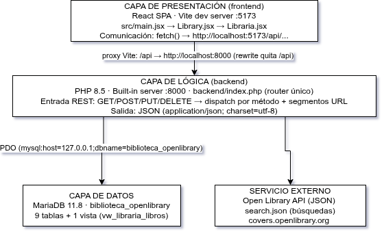
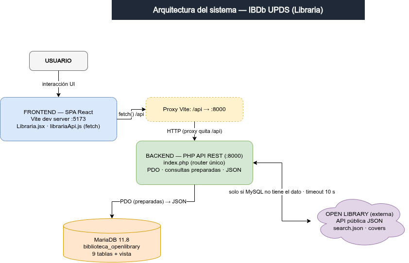
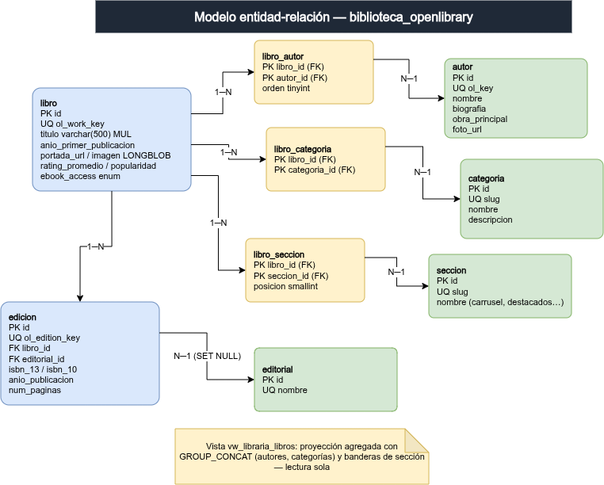

# Manual Técnico para Desarrolladores — IBDb UPDS ("Libraria")

| | |
|---|---|
| **Proyecto** | IBDb UPDS — Biblioteca Digital "Libraria" |
| **Materia** | Diseño Web II — UPDS |
| **Integrantes** | Pedro Aaron Espinoza Vargas · Mijael Douglas Lovera Rodriguez · Jerald Jose Corrales Velasquez |
| **Documento** | Manual Técnico (orientado a programadores y soporte) |
| **Fecha** | Agosto 2026 |

---

## Índice

1. [Descripción general de la arquitectura](#2-descripcion-general-de-la-arquitectura)
2. [Diagrama de arquitectura](#3-diagrama-de-arquitectura)
3. [Tecnologías y versiones](#4-tecnologias-y-versiones)
4. [Estructura de carpetas y archivos](#5-estructura-de-carpetas-y-archivos)
5. [Modelo de base de datos](#6-modelo-de-base-de-datos)
6. [Diccionario de datos](#7-diccionario-de-datos)
7. [Documentación de la API / endpoints](#8-documentacion-de-la-api--endpoints)
8. [Lógica de negocio relevante](#9-logica-de-negocio-relevante)
9. [Seguridad implementada](#10-seguridad-implementada)
10. [Pruebas realizadas](#11-pruebas-realizadas)
11. [Limitaciones y mejoras futuras](#12-limitaciones-y-mejoras-futuras)
12. [Referencias](#13-referencias)

---

## 2. Descripción general de la arquitectura

El sistema es una aplicación **cliente-servidor** con **arquitectura REST** propia: un
**frontend SPA en React** consume una **API HTTP en PHP** que, a su vez, lee y escribe en una
**base de datos MySQL (MariaDB)**. Además, el backend **consume una API externa**
(Open Library, formato JSON) como fuente secundaria de datos.

### 2.1 Capas y comunicación



### 2.2 Flujo de una petición típica

1. El usuario interactúa con la UI React; un componente llama a una función de
   `src/librariaApi.js` (cliente HTTP propio, usa `fetch` nativo).
2. La petición sale como `/api/libros?buscar=...`; el **proxy de Vite** la reenvía a
   `http://localhost:8000` y quita el prefijo `/api`.
3. `backend/index.php` interpreta la ruta y el método HTTP, valida la entrada y ejecuta la
   consulta PDO contra MariaDB.
4. El resultado se serializa como JSON y la UI lo convierte en objetos de libro
   (`desdeBD()` en `librariaApi.js`) para renderizar.
5. Si la consulta no encuentra resultados en MySQL (y viene un término de búsqueda), el
   backend **cae a Open Library**, guarda la respuesta cruda y migra los documentos a la BD
   (ver §9, lógica de negocio). Es el patrón *cache-aside*.

---

## 3. Diagrama de arquitectura



**Flujos de datos:**
- **A · Carga masiva (CLI):** `extraer.php` (Open Library → JSON en disco) → `migrar.php`
  (JSON → BD, upsert idempotente).
- **B · Catálogo:** `GET /libros` → respuesta desde la vista `vw_libraria_libros`.
- **C · Búsqueda híbrida:** MySQL primero; si `COUNT=0` y hay término → Open Library →
  JSON crudo a `datos/busquedas/` → `migrarDocs()` → re-consulta MySQL → `fuente:"openlibrary"`.
- **D · Portadas:** descarga del cover en la migración → `imagen LONGBLOB` →
  `GET /libros/{id}/portada` (cache 30 días); fallback: redirect 302 a `portada_url`; 404 si no hay.
- **E · Administración:** `POST`/`PUT`/`DELETE` sobre libros, autores y categorías con validación y transacciones.

---

## 4. Tecnologías y versiones

Verificado en el entorno de desarrollo (agosto 2026):

| Capa | Tecnología | Versión |
|---|---|---|
| Frontend | React / react-dom | 19.2.8 |
| Build/bundler | Vite | 8.2.1 |
| | @vitejs/plugin-react | 6.0.5 |
| UI | Bootstrap | 5.3.8 |
| Linting | ESLint + react-hooks/refresh/globals | 10.8.1 |
| Backend | PHP (CLI / built-in server) | 8.5.8 |
| Base de datos | MariaDB (motor) — cliente `mysql` | 11.8.8 (cliente 15.2) |
| JS runtime | Node.js | 24.15.0 |
| | npm | 11.12.1 |
| Cliente HTTP frontend | `fetch` nativo (sin librería de terceros) | — |
| Acceso a datos PHP | PDO (`pdo_mysql`) | incluida en PHP |

**Dependencias de terceros usadas:** solo las de la tabla (en el frontend) y la extensión PDO
en PHP. No se usa framework PHP (el enrutado es a mano), ni ORM, ni axios.

---

## 5. Estructura de carpetas y archivos

```
IBDb_UPDS/
├── index.html                  Soporte de entrada de Vite
├── package.json                Manifest npm (scripts, dependencias)
├── vite.config.js              Config: plugin React + proxy /api → :8000
├── eslint.config.js            Reglas de lint
├── .gitignore                  Excluye node_modules, dist, backend/config.php, backend/datos/
├── README.md                   Guía maestra de lanzamiento (Linux y Windows/XAMPP)
├── estructura.sql              Estructura completa de la BD (9 tablas + vista)
├── volcado26-08-26.sql         Volcado histórico de la BD
├── src/                        Código fuente del frontend
│   ├── main.jsx                Punto de montaje de React
│   ├── Library.jsx             Envoltorio que monta <Libraria />
│   ├── Libraria.jsx            Pantalla principal: cabecera, navegación por estado
│   │                           (vista: catalogo/autores/categorias/admin), listado, detalle
│   ├── Libraria.css            Estilos del catálogo
│   ├── librariaApi.js          Cliente HTTP de la API (+ CRUD, mapeo fila→objeto)
│   ├── Autores.jsx / .css      Índice alfabético de autores + filtro por autor
│   ├── Categorias.jsx / .css   Cuadrícula de categorías + filtro por categoría
│   ├── Admin.jsx / Admin.css   Panel de administración (CRUD libro/autor/categoría)
│   ├── SelectedWorks.jsx/.css  Sobrante de la plantilla (NO usado)
│   ├── App.jsx / App.css       Sobrante de la plantilla (NO usado)
│   └── assets, CSS, HTML, JS   Recursos y sobrantes de la plantilla
├── backend/                    Código fuente del backend PHP
│   ├── index.php               Router único de la API REST + lógica de negocio
│   ├── migrador.php            Módulo compartido: conversión JSON→SQL, descarga portadas
│   ├── extraer.php             CLI: extracción masiva Open Library → JSON
│   ├── migrar.php              CLI: JSON → BD (idempotente)
│   ├── descargar_portadas.php  CLI: baja portadas faltantes a la BD
│   ├── config.php              Credenciales reales (NO versionado, .gitignore)
│   ├── config.template.php     Plantilla pública de configuración
│   ├── crear_usuario.sql       SQL de ejemplo para un usuario de solo SELECT
│   ├── README.md               Docs técnicos del backend
│   ├── datos/                  Datos generados (NO versionado)
│   │   ├── openlibrary.json    Salida cruda de extraer.php
│   │   └── busquedas/*.json    Registros crudos por cada búsqueda en vivo
│   └── sql/
│       └── biblioteca_openlibrary.sql   Volcado completo auto-contenido (datos + portadas)
└── public/                     Recursos estáticos (imágenes placeholder/logo)
```

---

## 6. Modelo de base de datos

Base de datos **`biblioteca_openlibrary`** · motor **InnoDB** · charset **utf8mb4** ·
9 tablas + 1 vista.

### 6.1 Diagrama entidad-relación (resumen)



### 6.2 Relaciones (claves foráneas)

| Relación | Cardinalidad | FK | Regla de borrado |
|---|---|---|---|
| `edicion.editorial_id` → `editorial.id` | N : 1 | FK (`edicion_ibfk_2`) | `ON DELETE SET NULL` |
| `edicion.libro_id` → `libro.id` | N : 1 | FK (`edicion_ibfk_1`) | `ON DELETE CASCADE` |
| `libro_autor.autor_id` → `autor.id` | N : 1 | FK (`libro_autor_ibfk_2`) | `ON DELETE CASCADE` |
| `libro_autor.libro_id` → `libro.id` | N : 1 | FK (`libro_autor_ibfk_1`) | `ON DELETE CASCADE` |
| `libro_categoria.categoria_id` → `categoria.id` | N : 1 | FK (`libro_categoria_ibfk_2`) | `ON DELETE CASCADE` |
| `libro_categoria.libro_id` → `libro.id` | N : 1 | FK (`libro_categoria_ibfk_1`) | `ON DELETE CASCADE` |
| `libro_seccion.seccion_id` → `seccion.id` | N : 1 | FK (`libro_seccion_ibfk_2`) | `ON DELETE CASCADE` |
| `libro_seccion.libro_id` → `libro.id` | N : 1 | FK (`libro_seccion_ibfk_1`) | `ON DELETE CASCADE` |

La vista **`vw_libraria_libros`** es una proyección de `libro` + `libro_autor` + `autor` +
`libro_categoria` + `categoria` + `libro_seccion` + `seccion` que agrega autores y categorías
(con `GROUP_CONCAT`) y añade banderas de sección (ver §7.10).

---

## 7. Diccionario de datos

Diccionario levantado de la base de datos real (`DESCRIBE`).

### 7.1 `libro`   (PK `id`) — libros del catálogo

| Campo | Tipo | Clave | Descripción |
|---|---|---|---|
| `id` | int(10) unsigned | **PK**, auto_increment | Identificador interno |
| `ol_work_key` | varchar(30) | **UNI** | Clave única de Open Library (ej. `OL82563W`) |
| `titulo` | varchar(500) | MUL (`idx_libro_titulo`) | Título (obligatorio) |
| `descripcion` | text | — | Reseña/descripción |
| `anio_primer_publicacion` | smallint(5) unsigned | MUL (`idx_libro_anio`) | Año de 1ª publicación |
| `portada_url` | varchar(300) | — | URL original del cover (fallback) |
| `imagen` | longblob | — | Imagen de la portada persistida localmente |
| `enlace_lectura` | varchar(300) | — | URL de lectura (archive.org) si `ebook_access` en public/borrowable |
| `ebook_access` | enum('public','borrowable','printdisabled','no_ebook') | — | Nivel de acceso del ebook, default `no_ebook` |
| `idioma_principal` | char(3) | — | Código ISO 639-1 (ej. `eng`) |
| `rating_promedio` | decimal(3,2) | MUL (`idx_libro_rating`) | Calificación 0.00–5.00 (`chk_rating`) |
| `rating_total_votos` | int(10) unsigned | — | Cantidad de votos |
| `popularidad` | int(10) unsigned | MUL (`idx_libro_pop`) | `want_to_read_count` de OL |
| `sincronizado_en` | timestamp | — | Autoset, se actualiza al modificar |

Check constraint: `chk_rating` ⇒ `rating_promedio IS NULL OR rating_promedio BETWEEN 0 AND 5`.

### 7.2 `autor`   (PK `id`) — autores

| Campo | Tipo | Clave | Descripción |
|---|---|---|---|
| `id` | int(10) unsigned | **PK**, auto_increment | Identificador |
| `ol_key` | varchar(20) | **UNI** | Clave OL (ej. `OL161167A`) o `OLM`+8 hex para manuales |
| `nombre` | varchar(255) | — | Nombre (obligatorio) |
| `fecha_nacimiento` | varchar(60) | — | Fecha de nacimiento (free text) |
| `fecha_fallecimiento` | varchar(60) | — | Fecha de fallecimiento |
| `biografia` | text | — | Biografía |
| `obra_principal` | varchar(255) | — | `top_work` de OL |
| `total_obras` | int(10) unsigned | — | Conteo de obras reportado por OL |
| `foto_url` | varchar(300) | — | `covers.openlibrary.org/a/olid/{ol_key}-M.jpg` |
| `sincronizado_en` | timestamp | — | Autoset |

### 7.3 `categoria`   (PK `id`) — temas/tags

| Campo | Tipo | Clave | Descripción |
|---|---|---|---|
| `id` | int(10) unsigned | **PK**, auto_increment | Identificador |
| `slug` | varchar(120) | **UNI** | Dirección amigable única (p. ej. `ciencia-ficcion`) |
| `nombre` | varchar(150) | — | Nombre visible |
| `descripcion` | text | — | Descripción |

### 7.4 `editorial`   (PK `id`) — editoriales

| Campo | Tipo | Clave | Descripción |
|---|---|---|---|
| `id` | int(10) unsigned | **PK**, auto_increment | Identificador |
| `nombre` | varchar(200) | **UNI** | Nombre de la editorial |

### 7.5 `edicion`   (PK `id`) — ediciones concretas de un libro

| Campo | Tipo | Clave | Descripción |
|---|---|---|---|
| `id` | int(10) unsigned | **PK**, auto_increment | Identificador |
| `ol_edition_key` | varchar(30) | **UNI** | Clave de edición OL (ej. `OL61281195M`) |
| `libro_id` | int(10) unsigned | **FK** → `libro.id` | Libro al que pertenece |
| `editorial_id` | int(10) unsigned | **FK** → `editorial.id` | Editorial (NULL si se borró) |
| `isbn_13` | varchar(20) | **UNI** | ISBN-13 (si existe) |
| `isbn_10` | varchar(15) | — | ISBN-10 (si existe) |
| `anio_publicacion` | smallint(5) unsigned | — | Año de la edición |
| `portada_url` | varchar(300) | — | Portada específica de la edición |
| `num_paginas` | smallint(5) unsigned | — | Número de páginas |

### 7.6 `seccion`   (PK `id`) — secciones del sitio

| Campo | Tipo | Clave | Descripción |
|---|---|---|---|
| `id` | int(10) unsigned | **PK**, auto_increment | Identificador |
| `slug` | varchar(60) | **UNI** | `carrusel`, `destacados`, `novedades`, `recomendados` |
| `nombre` | varchar(120) | — | Nombre visible |
| `descripcion` | text | — | Descripción |

### 7.7 `libro_autor`   (PK compuesta `libro_id + autor_id`) — relación N:M

| Campo | Tipo | Clave | Descripción |
|---|---|---|---|
| `libro_id` | int(10) unsigned | **PK + FK** → `libro.id` | Libro |
| `autor_id` | int(10) unsigned | **PK + FK** → `autor.id` | Autor |
| `orden` | tinyint(3) unsigned | — | Orden de autoría (default 1) |

### 7.8 `libro_categoria`   (PK compuesta `libro_id + categoria_id`) — relación N:M

| Campo | Tipo | Clave | Descripción |
|---|---|---|---|
| `libro_id` | int(10) unsigned | **PK + FK** → `libro.id` | Libro |
| `categoria_id` | int(10) unsigned | **PK + FK** → `categoria.id` | Categoría |

### 7.9 `libro_seccion`   (PK compuesta `libro_id + seccion_id`) — relación N:M

| Campo | Tipo | Clave | Descripción |
|---|---|---|---|
| `libro_id` | int(10) unsigned | **PK + FK** → `libro.id` | Libro |
| `seccion_id` | int(10) unsigned | **PK + FK** → `seccion.id` | Sección |
| `posicion` | smallint(5) unsigned | — | Orden dentro de la sección/carrusel |

### 7.10 Vista `vw_libraria_libros`

No es tabla: es una proyección agregada para leer el catálogo con una sola consulta.
Columnas expuestas:

| Campo | Origen | Descripción |
|---|---|---|
| `id`, `ol_work_key`, `titulo` | `libro` | Identidad del libro |
| `autores` | `GROUP_CONCAT` sobre `autor.nombre` | Autores separados por `, ` |
| `autor_key` | subconsulta por `orden` | Clave OL del primer autor |
| `isbn_13` | subconsulta sobre `edicion` | Primer ISBN-13 disponible |
| `portada_url`, `enlace_lectura` | `libro` | URLs (la imagen BLOB NO se proyecta a propósito) |
| `anio`, `rating`, `votos`, `popularidad` | `libro` | Datos para listado/orden |
| `categorias` | `GROUP_CONCAT` sobre `categoria.nombre` | Categorías separadas por `, ` |
| `destacado`, `novedad`, `recomendado`, `en_carrusel` | `EXISTS` sobre `libro_seccion`+`seccion` | Banderas 0/1 |
| `posicion_carrusel` | subconsulta sobre `libro_seccion`/`seccion` | Posición en el carrusel |

**Conteo actual** (agosto 2026): `libro` ≈92 · `autor` ≈64 · `categoria` ≈220 ·
`edicion` ≈92 · `editorial` ≈76. Las tablas `seccion` y `libro_seccion` están vacías en el
entorno actual (las secciones se pueblan con el *seed* opcional).

---

## 8. Documentación de la API / endpoints

Base URL: `http://localhost:8000` (línea `php -S 127.0.0.1:8000 -t backend backend/index.php`).
En el frontend todo se pide con prefijo `/api` (el proxy de Vite lo elimina).
Formato de error uniforme: `{"error":"<mensaje>"}`.
Métodos no permitidos → `405`.

### 8.1 `GET /libros` — listar y buscar

| Parámetro | Tipo | Default | Descripción |
|---|---|---|---|
| `buscar` | string | `''` | Filtro por título o autor (`LIKE`) |
| `categoria` | string | `''` | Filtro por `slug` de categoría (subquery `libro_categoria`) |
| `orden` | enum | `default` | `default \| popularity \| rating \| newness` (whitelist) |
| `pagina` | int | `1` | Número de página |
| `porPagina` | int | `12` | Máx. 50, mín. 1 |

Respuesta: `{total:int, rows:[*vw_libraria_libros], fuente:"mysql"|"openlibrary"}`.
Ejemplo real (probado):

```jsonc
GET /libros?buscar=Arthur+Conan+Doyle&porPagina=2
{
  "total": 10,
  "fuente": "mysql",
  "rows": [
    {
      "id": 1,
      "ol_work_key": "OL262421W",
      "titulo": "The Adventures of Sherlock Holmes [12 stories]",
      "autores": "Arthur Conan Doyle",
      "autor_key": "OL161167A",
      "isbn_13": "9781086410778",
      "portada_url": "https://covers.openlibrary.org/b/id/6717853-M.jpg",
      "enlace_lectura": "https://archive.org/details/adventureofsherl0000unse",
      "anio": 1892,
      "rating": "4.16",
      "votos": 171,
      "popularidad": 2654,
      "categorias": "amorality, Classic Literature, Conclusions, Murder, Mystery",
      "destacado": 0, "novedad": 0, "recomendado": 0, "en_carrusel": 0,
      "posicion_carrusel": null
    }
  ]
}
```

### 8.2 `POST /libros` — crear

Body JSON: `titulo` (obligatorio), `descripcion`, `anio_primer_publicacion`,
`portada_url`, `imagen` (base64), `enlace_lectura`, `rating_promedio` (0–5),
`autores[]`, `categorias[]`, `ol_work_key` (opcional; si falta se genera `OLM`+8 hex).
Respuesta: `201` + fila del libro creado. Validaciones: título obligatorio (`400`),
rating fuera de 0–5 (`400`).

### 8.3 `PUT /libros/{id}` — actualizar

Body JSON parcial; solo se admiten las columnas de la whitelist:
`titulo, descripcion, anio_primer_publicacion, portada_url, imagen, enlace_lectura, rating_promedio`.
`imagen` se envía en base64 y se decodifica con `base64_decode(...,true)`. Si el id no existe → `404`; sin campos → `400`.

### 8.4 `DELETE /libros/{id}` — eliminar

Respuesta: `204` sin cuerpo. No existe → `404`. El borrado en cadena elimina
autorías, categorías, ediciones y secciones relacionadas.

### 8.5 `GET /libros/{id}/portada` — servir imagen

- Si `imagen` (BLOB) existe → `200` `Content-type: image/jpeg`, `Cache-Control: public, max-age=2592000`.
- Si no hay BLOB pero sí `portada_url` → `302` (redirección a la URL original).
- Si no hay nada → `404` `{"error":"Portada no disponible"}`.

Ejemplo real: `GET /libros/1/portada` → `200 image/jpeg`, 8466 bytes.

### 8.6 `GET /autores` — listar autores

Respuesta: array de `{id, ol_key, nombre, foto_url, obra_principal, total_obras, libros}`,
donde `libros = COUNT(libro_autor)` agrupado por autor, ordenado por popularidad.
Ejemplo real: `GET /autores` → primer elemento `{"id":1,"ol_key":"OL161167A","nombre":"Arthur Conan Doyle","...","libros":10}`.

### 8.7 `POST /autores` — crear

Body: `{nombre}` (obligatorio). Genera `ol_key` `OLM`+4 bytes hex. → `201` + fila.

### 8.8 `PUT /autores/{id}` — actualizar

Whitelist: `nombre, biografia, obra_principal, fecha_nacimiento, fecha_fallecimiento`.
`nombre` no puede quedar vacío (`400`). No existe → `404`.

### 8.9 `DELETE /autores/{id}` — eliminar

`204`; no existe → `404`.

### 8.10 `GET /categorias` — listar

Respuesta: array de `{id, slug, nombre, libros}` (conteo de libros por categoría).
Ejemplo real: `{"id":118,"slug":"achilles-greek-mythology","nombre":"Achilles (Greek mythology)","libros":1}`.

### 8.11 `POST /categorias` — crear

Body: `{nombre, descripcion?}`. El `slug` se genera con `slugificar()` (regex `[a-z0-9]+`,
separador `-`); si ya existe → `409`; slug vacío o >120 → `400`. → `201` + fila.

### 8.12 `PUT /categorias/{id}` — actualizar

Renombra y recalcula el slug; duplicado con otra categoría → `409`; vacío → `400`.

### 8.13 `DELETE /categorias/{id}` — eliminar

`204`; no existe → `404`.

### 8.14 `GET /secciones/{slug}` — libros de una sección

Parámetro de ruta limitado por whitelist: `carrusel, destacados, novedades, recomendados`.
Query param `limite` (default 10, máx 50). Ordena por `libro_seccion.posicion`.
Respuesta: array de `vw_libraria_libros`. Slug fuera de la whitelist → `404`.

---

## 9. Lógica de negocio relevante

### 9.1 Migración idempotente (upsert)

`migrador.php` convierte un documento JSON de Open Library en filas SQL dentro de una
transacción. La clave de idempotencia es:
- libros → `libro.ol_work_key` (si existe se hace `UPDATE`, no `INSERT`);
- autores → `autor.ol_key`; editoriales → `editorial.nombre`; categorías → `categoria.slug`.

Repetir una migración no duplica registros; solo actualiza. `migrarDocs()` además invoca
`descargarPortadasPendientes()` tras el `commit`.

### 9.2 Búsqueda híbrida (cache-aside)

1. `listarLibros()` consulta `COUNT(*)` con los filtros.
2. Si `total===0 && buscar!==''`, llama `consultarOpenLibrary($buscar)` → `search.json`
   (timeout 10 s, `User-Agent` propio, `limit=10`).
3. `guardarBusqueda()` persiste el JSON crudo en `datos/busquedas/{fecha}_{termino}.json`.
4. `migrarDocs($docs)` inserta los documentos y sus portadas.
5. Se re-ejecuta la consulta y se responde con `fuente:"openlibrary"`; el frontend marca
   esos resultados como "nuevos desde Open Library". La siguiente búsqueda sale de MySQL.

### 9.3 Persistencia y servicio de portadas

Al migrar, `descargarPortadasPendientes()` recorre `libro` donde
`imagen IS NULL AND portada_url IS NOT NULL`, descarga el cover y lo guarda en `imagen`
(LONGBLOB). El endpoint de portada prioriza el blob local; si falta, redirige 302. El frontend
arma `img = /api/libros/{id}/portada` con `fallbackImg = portada_url` y un `` que
cae al fallback local definitivo (`public/images/...`).

### 9.4 Claves propias para registros manuales

Registros creados a mano (no vienen de OL) reciben claves `OLM` + 4 bytes aleatorios en hex
(`random_bytes(4)` → 8 caracteres) para `ol_key` y `ol_work_key`, evitando colisiones con las
claves reales de Open Library.

### 9.5 Calificaciones y ordenamiento

`rating_promedio` se limita a 0–5 en la capa PHP y por `chk_rating` en la BD. El ordenamiento
solo admite valores del mapa whitelist (`popularity` → `popularidad DESC, votos DESC`;
`rating` → `rating DESC, votos DESC`; `newness` → `anio DESC`; `default` → `id`).

### 9.6 Enlace de lectura

Solo se genera `enlace_lectura` (`archive.org/details/{ia}`) cuando `ebook_access` ∈
`public|borrowable` — evita enlaces rotos a obras protegidas.

---

## 10. Seguridad implementada

### 10.1 Prevención de inyección SQL

100% de las consultas usan `PDO::prepare()` con placeholders (`?`) y bindeo de valores.
Ningún dato de usuario se interpola en SQL. La interpolación de nombres de columna está
restringida a whitelists internas:
- `$mapaOrden` en `listarLibros()` (parametrización del `ORDER BY`);
- `$permitidos` en `actualizarLibro()`/`actualizarAutor()` (columnas editables);
- slugs de sección permitidos en `listarSeccion()`.
El valor `$limite` se normaliza con `max(1,min(50,(int)...))` antes de interpolarse.

### 10.2 Validación de entrada

- `idDeRuta()`: cast a `(int)` y rechazo si `<=0` (400).
- Título obligatorio en `crearLibro()` (400).
- `rating_promedio`: entre 0 y 5 (400) — refuerzo de `chk_rating`.
- `anio_primer_publicacion`: comilla a `[0,65535]`.
- `imagen`: `base64_decode(..., true)` estricto + longitud mínima >100 bytes.
- Categorías: `slugificar()` (transliteración UTF-8→ASCII, regex `/[^a-z0-9]+/`), largo ≤120, duplicado → 409.
- `porPagina`/`limite`: comilla a rangos.

### 10.3 Manejo de errores y disponibilidad

- Respuestas HTTP semánticas: `400` (datos inválidos), `404` (recurso/ruta), `405` (método),
  `409` (duplicado), `500` (excepción atrapada por `try/catch` global).
- Respuestas uniformes en JSON (`JSON_UNESCAPED_UNICODE|JSON_UNESCAPED_SLASHES`).
- Transacciones con rollback en `crearLibro()` y `migrarDocs()` ("todo o nada").

### 10.4 CORS

`Access-Control-Allow-Origin: *`, métodos `GET,POST,PUT,DELETE,OPTIONS`, headers
`Content-Type`, y respuesta `204` para preflight `OPTIONS`.

### 10.5 Credenciales y datos sensibles

- `backend/config.php` está en `.gitignore` (no se versiona).
- Se publica `config.template.php` con valores de ejemplo para que cada entorno copie y configure.
- `backend/datos/` (JSON crudos) también está fuera de Git.
- La conexión PDO usa `charset=utf8mb4` y `ERRMODE_EXCEPTION`.

### 10.6 Datos externos

Todas las llamadas salientes a Open Library usan `stream_context_create` con `timeout=10`
y `User-Agent` propio, evitando que el servidor PHP se cuelgue si la API externa no responde.

### 10.7 Lo que NO está implementado (transparencia)

El panel Admin es accesible sin autenticación (solo oculto tras un botón en la UI), no hay
HTTPS en el entorno de desarrollo ni `password_hash` (no existe login de usuarios), CORS está
abierto (`*`) y no hay *rate limiting*. Adecuado para la entrega académica; ver §12.

---

## 11. Pruebas realizadas

Pruebas funcionales ejecutadas contra la API (curl) y el build del frontend:

| # | Caso | Entrada / operación | Resultado esperado | Resultado obtenido |
|---|---|---|---|---|
| 1 | Listado de libros | `GET /libros?porPagina=2` | `{total, rows[2], fuente}` HTTP 200 | 200, JSON correcto |
| 2 | Búsqueda por autor | `GET /libros?buscar=Arthur+Conan+Doyle` | total=10 | total=10 |
| 3 | Fuente externa | Búsqueda inexistente en BD | `fuente="openlibrary"` | OK (documentos migrados) |
| 4 | Filtro por categoría | `GET /libros?categoria=fiction` | total=10 | total=10 |
| 5 | Filtro combinado | `?categoria=fiction&buscar=Sherlock` | total=5 | total=5 |
| 6 | Portada persistida | `GET /libros/1/portada` | 200 `image/jpeg` BLOB | 200, 8466 bytes, `image/jpeg` |
| 7 | Portada inexistente | `GET /libros/43/portada` | 404 | 404 `{"error":"..."}` |
| 8 | Crear libro | `POST /libros` (título válido) | 201 + fila | 201 + fila |
| 9 | Crear libro inválido | `POST /libros` (sin título) | 400 | 400 |
| 10 | Actualizar | `PUT /libros/{id}` | 200 + fila actualizada | 200 |
| 11 | Eliminar | `DELETE /libros/{id}` | 204 sin cuerpo | 204 |
| 12 | Recurso inexistente | `GET /libros/999999` | 404 | 404 |
| 13 | Método no permitido | e.g. `PUT` a una ruta solo-GET | 405 | 405 |
| 14 | Categoría duplicada | `POST /categorias` mismo nombre | 409 | 409 |
| 15 | Idempotencia | Ejecutar migración 2 veces | Sin duplicados (UPDATE) | Sin duplicados |
| 16 | Build frontend | `npm run build` (Vite) | Sin errores | Build OK |
| 17 | Descarga de portadas | `mysql ... (imagen IS NOT NULL)` | ≈42 libros con portada | 42/52 con portada |

---

## 12. Limitaciones y mejoras futuras

**Limitaciones actuales:**
- El panel de administración **no pide credenciales** (sin sesiones ni roles).
- No hay HTTPS fuera de Vite dev (el servidor PHP es HTTP plano, apto solo para local).
- CORS abierto `Access-Control-Allow-Origin: *`.
- Sin *rate limiting* ni throttling de peticiones.
- Las tablas `seccion`/`libro_seccion` están vacías en el entorno base (no se importó el seed);
  por tanto `/secciones/*` devuelve listas vacías hasta poblar.
- La vista no expone el BLOB de imagen (por diseño); requiere el endpoint de portada (§8.5).
- Sobran archivos de la plantilla original (`App.jsx`, `SelectedWorks.jsx`, `assets/`, `CSS/`…)
  que no participan en la pantalla actual y conviene limpiar.

**Mejoras futuras (con más tiempo):**
- Autenticación y autorización del panel Admin (login con `password_hash`/`password_verify`,
  sesiones PHP o JWT).
- Restringir CORS a orígenes explícitos y servir el backend bajo HTTPS (Apache/XAMPP + TLS).
- Implementar `rate limiting` por dirección IP.
- Conectar una vista de detalle de libro con datos enriquecidos (p. ej. `SelectedWorks.jsx`
  como página de detalle real o una nueva).

---

## 13. Referencias

- `README.md` (raíz) — lanzamiento del proyecto en Linux y Windows/XAMPP.
- `backend/README.md` — arquitectura y endpoints del backend.
- `docs/ManualTecnico.md` — manual divulgativo en lenguaje simple.
- `../APIINvestigacion/GuiaAPI.md` — explicación educativa de qué es una API.
- `estructura.sql` / `backend/sql/biblioteca_openlibrary.sql` — estructura y volcado completo.
- Open Library API: https://openlibrary.org/developers/api
